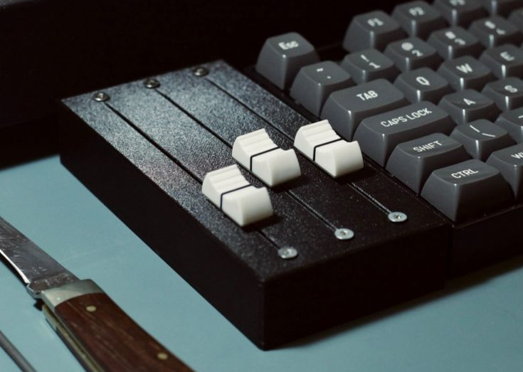
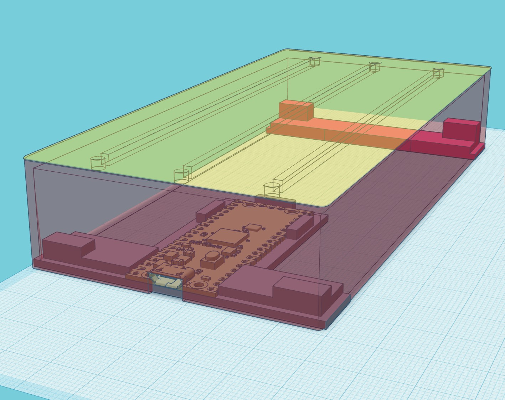
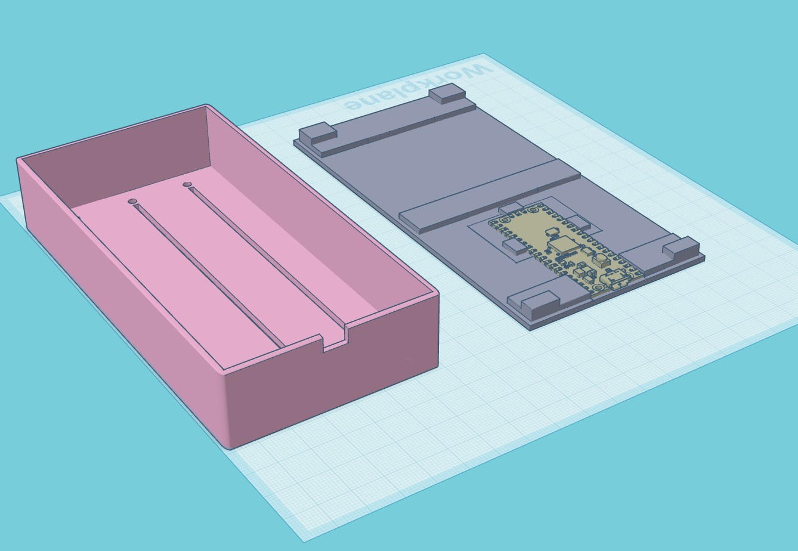

# Fader3
 3-fader USB MIDI controller

## Project Spec

I wanted a USB MIDI controller consisting of only 3 faders, and while they needed to be the longest-throw faders possible, I also wanted the device to take up as little space on my desk as possible - in height as well as width and depth.

Like a lot of composers, I control expression and dynamics of software instruments such as orchestral sample libraries using some kind of hardware control with one hand, while playing notes on a keyboard using the other. 

And because I also do a lot of audio post, dialogue editing and dubbing mixes, I wanted another fader that I could arbitrarily map to gain stage controls on a per-track basis in my DAW - this is essential for recording large amounts of volume automation in an efficient way. 

Very nice devices of this type are commercially available, but they often have cases that are a bit too large for my tastes - usually due to having LCD displays and/or buttons for extra functionality. I'd rather save the desk space and use raw SYSEX messages to change setting when (rarely) necessary.

## Requirements:

### Hardware
* Raspberry Pi Pico
* Three 100mm-throw B-taper (linear) faders matching [these dimensions](https://www.bourns.com/docs/Product-Datasheets/PTB.pdf)
* Wire, M3 bolts, M2 bolts
* Access to some kind of 3D printer
* 3x fader/linear slider caps with 8mm x 1.2mm hole (min shaft depth 3.0mm, max shaft depth 6.5mm)

### Software
* CircuitPython UF2 from [here](https://circuitpython.org/downloads)
* Mu editor [via these instructions](https://learn.adafruit.com/getting-started-with-raspberry-pi-pico-circuitpython/installing-mu-editor)

## Instructions:

Print the case and the base from the supplied STL files.

Note that the case has a 0.2mm layer over the top: this is not a mistake. Firstly it helps the printer lay down the bolt holes and fader slots if you're having any trouble with adhesion; secondly it gives a nice finish to the top surface. 

You'll have to cut through the slot and bolt holes. I recommend starting the bolt holes with an awl, then drilling through with a 3mm bit in a pin vice (small unpowered hobby drill), and finishing with a needle file until M3 bolts pass through comfortably. Holding the case up to a light shows where the holes are.

Similar for the slots: use a sharp knife to slowly puncture the end of each slot and drag down carefully. A steel rule will help avoid veering off and cutting into the main body of the case. When they're all cut, a ~2mm emery board or sanding stick should be used in each slot until the fader can fit through and slide up and down unimpeded.

The Pi Pico sits in the base, and the micro USB socket should line up nicely with the case top. It's advisable to bolt down the Pico - M2 bolts should be used, with appropriate holes drilled through the base (the pin vice again!). M2*6 bolts with M2 nuts on the underside should work, and won't scrape your desk since you'll be sticking rubber feet on all four corners of the base.

Rubber feet: buy a selection pack of 3M sticky feet for a few quid - they'll come in handy for all sorts of things.

Once the faders are in the slots, bolt them down from the top with M3*6 bolts. Countersunk bolts are best; panhead bolts might catch on the fader caps. You might want to countersink the holes a little, but since my design incorporates some degree of countersinking _under_ the top 0.2mm layer, just tightening them up should sink them into the surface of the case sufficiently.

The Pico will need to distribute 3.3v and GND to each fader's 1 and 3 pins in parallel, not in series. I've made up wires that split 1 into 3 for both of these. Finally, the Pico's analogue pins A0, A1 and A2 need to be connected to pin 2 of each fader.

The first time you plug in a new Pico, you'll see a mass storage device appear. The circuitpython firmware UF2 from adafruit should be dragged into this device, which will cause the Pico's bootloader to be overwritten. When it's replugged, you should see another mass storage device: CIRCUITPY. This is where you'll be putting boot.py and code.py. 

But first, edit code.py to set up some values - CC numbers, channel, etc. Mu Editor might be a good choice for making these changes, since it's set up with some contextual help for Micropython/Circuitpython.

Into the libs directory, place the adafruit_midi directory and its contents from [here](https://github.com/adafruit/Adafruit_CircuitPython_MIDI).

Now drag adafruit_midi into the CIRCUITPY\libs directory, and code.py and boot.py into the CIRCUITPY root.

If everything's soldered up properly, then you should now be able to replug the device and see a new MIDI device called 'CircuitPython Audio', with CC commands appearing on the specified numbers.

## Notes:

### Faders
I got my faders from Amazon in the UK, listed as ['sourcing map B103 128mm 10k double potentiometers'](https://www.amazon.co.uk/gp/product/B07W3J5ZVM/); after a bit of detective work, I found that the Bourne datasheet linked above matches these exactly. Perhaps they're licensed, or a knock-off, I'm not sure. 

### Availability
I'm sorry, I can't make one for you! When I made Knobber over a decade ago, a lot of people asked me to make one for them and I just didn't have the time. I still don't! But I've shared as much info as I can to help any intrepid DIYer make their own. 

### DIY
Rudimentary soldering skills and access to a 3D printer (often available cheaply or for free at local maker spaces) should be all you need - although I accept no responsibility if anything goes terribly wrong, causes an accident, causes you to lose money by buying the wrong parts, etc. All the above is what worked for me; your mileage may vary.

### Technical
The Raspberry Pi Pico has 3 ADC (analogue to digital converter) channels which - allegedly - suffer from some noise at the upper and lower end of their ranges due to the Pico's built in voltage-referencing system. I definitely found jittering throughout and a great amount of it near the top of the faders. 

Jitter's a problem here mainly because you get inconsistent values for a given fader position, but also because jittery values create an endless stream of MIDI messages which can really clog up your project automation fast. 

I have three techniques for dealing with this: 
1. I compare new CC values against previous values and only send a message if the value has changed beyond a threshold (1 by default) 
2. At the cost of a tiny amount of latency I take an average of 64 samples from each ADC pin rather than a single read (number of samples can be configured)
3. I zero the lower 4 bits of the Pico ADCs' 12-bit values in order to get an 8-bit value, which is still more than we need for the 7-bit range (0 to 127) of standard resolution MIDI. It would be cool to try doing 14-bit (or high-res) MIDI, but I'd probably need to use an external 16-bit ADC board rather than 'upscaling' the Pico's 12-bit values... I have some external ADC boards and I'll test this some time.

## Changes / To Do:

### To do
* Rotate case before exporting STL
* Improve base so it extends the full length while still allowing Pico to be flush
* Maybe clarify some stuff with the code
* Implement the sysex config
* Consider a startup mode to force mass storage - maybe all faders to max when plugging in? 

### Changes
* 2024-01-01 Initial commit