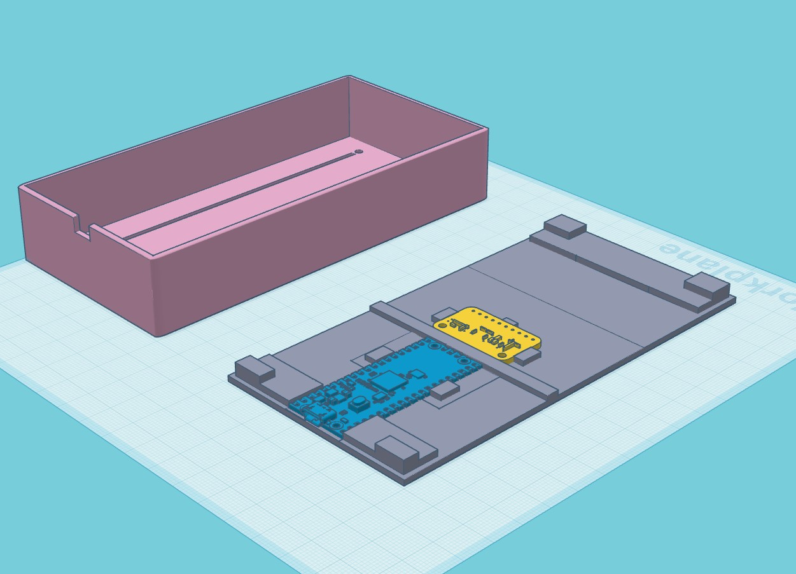

# Fader3
 3-fader USB MIDI controller

## Project Spec

A 14-bit USB MIDI controller with 3 long-throw (100mm) faders in a compact case. There are no buttons or display screens, in order to keep the desk footprint as small as possible: 6.7cm wide, 13.6cm deep and 2.5cm high.

Fader3 acts as a conventional 7-bit MIDI controller by default, but when an inexpensive external ADC board is added, each fader can individually be set to act as a 14-bit, high resolution MIDI control. This increases the number of possible steps in the control range from 128 to 16,384 and can greatly smooth parameter adjustments, avoiding any audible 'stepping' on things like volume envelopes or filter sweeps.

### Commercially available alternatives (if you don't want to build your own)

I'm aware of similar devices that already exist in this small niche, and for lots of people they'll be perfect. Here are the ones I know of:
* [EXC-3 USB Expression Controller](https://expressioncontroller.blogspot.com/2021/06/plug-and-play-usb-controller.html?ref=soundonsoundnews)
* [MIDI-Controller-Modz](https://midi-controller-modz.com/products/3-fader-usb-and-din-midi-with-expression-pedal-input)
* [The Midi Maker Sparrow](https://themidimaker.com/products/sparrow-3x100mm-midi-47280)
* [Nuances Controller](https://nuancescontroller.fr/)

Some are quite expensive, some have waiting lists, some are bigger and take up more desk space than I'd like, some have faders that are too short for me, some have buttons and screens that I don't need - but those are all ME problems; they might not be YOU problems! 

They are also handmade in small batches, have good quality control, come with proper documentation and after-sales support, and are all beautifully designed items that'll look and feel good on your work desk.

Unless you're comfortable building DIY electronics projects and dealing with the inevitable faff of solding mistakes, serial connectivity issues and 3D printer hassle, you should probably investigate one of those commercially available devices.

However...it appears that none of them do 14-bit MIDI. So if you really want that functionality, Fader3 might be worth building.

## Requirements:

### Hardware
* Raspberry Pi Pico
* Three 100mm-throw B-taper (linear) faders matching [these dimensions](https://www.bourns.com/docs/Product-Datasheets/PTB.pdf)
* ADS1115 analogue-digital converter board
* Wire, M3 bolts, M2 bolts
* Access to some kind of 3D printer
* 3x fader/linear slider caps with 8mm x 1.2mm hole (min shaft depth 3.0mm, max shaft depth 6.5mm)

### Software
* CircuitPython UF2 from [here](https://circuitpython.org/downloads)
* Mu editor [via these instructions](https://learn.adafruit.com/getting-started-with-raspberry-pi-pico-circuitpython/installing-mu-editor)
* OR Visual Studio Code with the [CircuitPython v2 extension](https://marketplace.visualstudio.com/items?itemName=wmerkens.vscode-circuitpython-v2)

## Instructions:

Print the case and the base from the supplied STL files.

Note that the case has a 0.2mm layer over the top: this is not a mistake. Firstly it helps the printer lay down the bolt holes and fader slots if you're having any trouble with adhesion; secondly it gives a nice finish to the top surface. 

You'll have to cut through the slot and bolt holes. I recommend starting the bolt holes with an awl, then drilling through with a 3mm bit in a pin vice (small unpowered hobby drill), and finishing with a needle file until M3 bolts pass through comfortably. Holding the case up to a light shows where the holes are.

Similar for the slots: use a sharp knife to slowly puncture the end of each slot and drag down carefully. A steel rule will help avoid veering off and cutting into the main body of the case. When they're all cut, a ~2mm emery board or sanding stick should be used in each slot until the fader can fit through and slide up and down unimpeded.

The Pi Pico sits in the base, and the micro USB socket should line up nicely with the case top. It's advisable to bolt down the Pico - M2 bolts should be used, with appropriate holes drilled through the base (the pin vice again!). M2*6 bolts with M2 nuts on the underside should work, and won't scrape your desk since you'll be sticking rubber feet on all four corners of the base.

Rubber feet: buy a selection pack of 3M sticky feet for a few quid - they'll come in handy for all sorts of things.

Once the faders are in the slots, bolt them down from the top with M3*6 bolts. Countersunk bolts are best; panhead bolts might catch on the fader caps. You might want to countersink the holes a little, but since my design incorporates some degree of countersinking _under_ the top 0.2mm layer, just tightening them up should sink them into the surface of the case sufficiently.

The ADS1115 board needs 3.3v and GND from the Pico, and also SDA and SDL from pins GP16 and GP17 respectively. Then each fader will also need 3.3v and GND on pins 1 and 3, while pin 2 (the wiper contact) should be connected to the ADS1115's ADC channels: 0, 1 and 2.

If you're not using the ADS1115, the faders' wiper pins instead go to the Pico's analogue pins A0, A1 and A2.

The first time you plug in a new Pico, you'll see a mass storage device appear. The circuitpython firmware UF2 from adafruit should be dragged into this device, which will cause the Pico's bootloader to be overwritten. When it's replugged, you should see another mass storage device: CIRCUITPY. This is where you'll be putting boot.py and code.py. 

But first, edit code.py to set up some values - CC numbers, channel, etc. Mu Editor might be a good choice for making these changes, since it's set up with some contextual help for Micropython/Circuitpython.

Into the libs directory on CIRCUITPY, place the adafruit_midi directory and its contents from
[https://github.com/adafruit/Adafruit_CircuitPython_MIDI](https://github.com/adafruit/Adafruit_CircuitPython_MIDI). 
 
Do the same with the adafruit_ads1x15 directory and its contents from
[https://github.com/adafruit/Adafruit_CircuitPython_ADS1x15/releases/download/2.4.1/adafruit-circuitpython-ads1x15-9.x-mpy-2.4.1.zip](https://github.com/adafruit/Adafruit_CircuitPython_ADS1x15/releases/download/2.4.1/adafruit-circuitpython-ads1x15-9.x-mpy-2.4.1.zip).

Now drag code.py and boot.py into the CIRCUITPY root.

If everything's soldered up properly, then you should now be able to replug the device and see a new MIDI device called 'CircuitPython Audio' with CC commands appearing on the specified numbers.

### Using ADS1115 as external ADC:

### Using Pico's internal ADC:

## Config options:

* faderMidiChannel (array): set a MIDI channel for each fader separately
* faderCCNumber: set a CC number for each fader separately
* faderEnabled: set True or False to toggle a fader on or off
* enable14bitmode: set True or False to enable 14-bit MIDI mode on each individual fader
* smoothingSamples14bit: if you're experiencing jitter, adjusting this value might help. Higher values mean more smoothing but introduce slightly more lag. The value represents the number of fader readings that are summed and averaged
* smoothingSamples7bit: as above
* newValueThreshold14bit: prevent new MIDI messages from being sent unless this threshold is exceeded by a new value above or below the previous value; this can reduce jitter and compensate for interference
* newValueThreshold7bit: as above, but is way lower by default since you can't afford to lose too much resolution in 7-bit mode
* enableDebugMode: when true, debug log output is printed to the serial monitor and can be viewed in Mu or VS Code

## Notes:

### 14-bit Mode
14-bit MIDI was provided for in the MIDI 1.0 specification, back in the early 1980s. In theory, CC numbers 32 to 63 "are reserved for optional use as the LSB (Least Significant Byte) when higher resolution is required and correspond to 0 through 31 respectively". Most manufacturers and programmers since have ignored this principle, and use 32-63 for whatever they want. But any DAWs and hardware devices which handle 14-bit MIDI properly will recognise consecutive messages on e.g. CC15 and CC47 as being the lower (LSB) and upper (MSB) bytes of a two-byte, 14-bit controller message as opposed to the usual one-byte, 7-bit MIDI CC message.

Why use it? Sometimes you want a really smooth control change, and especially with long-throw faders like these, it's nice to get very fine control over fractions of a dB, or precise filter cutoff frequencies, and so on. With 7-bit MIDI you may end up wasting a lot of that extra physical resolution and, worst case, hear 'stepping' as values change in the 0-127 range. 14-bit CCs go from 0 to 16383, so that ceases to be an issue.

Since the Raspberry Pi Pico has a 12-bit ADC which isn't terribly accurate, particularly at the upper end of its range (due - apparently - to an unreliable voltage reference source), we can use a very cheap, compact and accurate external ADC chip called the ADS1115 which has 16-bit resolution (effectively 15-bit, since the 16th is used as a sign bit), 4 channels, and an excellent CircuitPython library from adafruit. 

The board takes 3.3v and GND from the Pico and also uses pins 16 and 17 for its SDA and SDL pins (clock and data lines). The code checks for its presence; if it's not found, it falls back to using the Pico's ADC pins in 7-bit. If found, you can use 14-bit or 7-bit and some config options - for smoothing and so on - can be set separately for each mode. 

I don't know how liberal some DAWs are in interpreting the o.g. MIDI spec, but it's probably safest to keep faderCCnumbers below 32 since the code simply adds 32 to each CC value to get the other byte's target.

### Faders
I got my faders from Amazon in the UK, listed as ['sourcing map B103 128mm 10k double potentiometers'](https://www.amazon.co.uk/gp/product/B07W3J5ZVM/); after a bit of detective work, I found that the Bourne datasheet linked above matches these exactly. Perhaps they're licensed, or a knock-off, I'm not sure. 

### Availability
I'm sorry, I can't make one for you! When I made Knobber over a decade ago, a lot of people asked me to make one for them and I just didn't have the time. I still don't! But I've shared as much info as I can to help any intrepid DIYer make their own. 

### DIY
Rudimentary soldering skills and access to a 3D printer (often available cheaply or for free at local maker spaces) should be all you need - although I accept no responsibility if anything goes terribly wrong, causes an accident, causes you to lose money by buying the wrong parts, etc. All the above is what worked for me; your mileage may vary.

### Technical
<del>
The Raspberry Pi Pico has 3 ADC (analogue to digital converter) channels which - allegedly - suffer from some noise at the upper and lower end of their ranges due to the Pico's built in voltage-referencing system. I definitely found jittering throughout and a great amount of it near the top of the faders. 

Jitter's a problem for us  mainly because we get inconsistent values for a given fader position, but also because jittery values create an endless stream of MIDI messages which can really clog up a DAW project's automation fast. 

I have three techniques for dealing with this: 
1. I compare new CC values against previous values and only send a message if the value has changed beyond a threshold (1 by default) 
2. At the cost of a tiny amount of latency I take an average of 64 samples from each ADC pin rather than a single read (number of samples can be configured)
3. I zero the lower 4 bits of the Pico ADCs' 12-bit values in order to get an 8-bit value, which is still more than we need for the 7-bit range (0 to 127) of standard resolution MIDI. It would be cool to try doing 14-bit (or high-res) MIDI, but I'd probably need to use an external 16-bit ADC board rather than 'upscaling' the Pico's 12-bit values... I have some external ADC boards and I'll test this some time.
</del>

## Changes / To Do:

### To do
* Rotate case before exporting STL
* Redesign base for ADS1115
* Implement the sysex config
* Consider a startup mode to force mass storage - maybe all faders to max when plugging in? 

### Changes
* 2024-01-04 14-bit support
* 2024-01-01 Initial commit